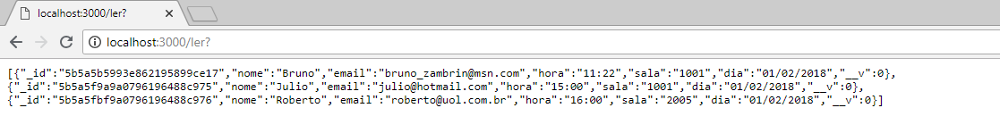

# Agendamento de Salas 

Esse projeto foi feito para a solução do seguinte problema:
O João, responsável pelo departamento de logistica da IBM Brasil, tem um sério problema com o agendamento e disponibilização de sua sala de reunião. Com base nisso, o João requisitou ao time de desenvolvimento uma aplicação, onde seja possivel visualizar a disponibilidade da sala de reunião, e-mail reservar a mesma, caso tenha necessidade. O unico pedido de João ao time de TI foi: Somente ele deve reservar horario na sala de reunião, porém todos os demais usuários, podem visualizar os horarios disponiveis da sala, e fazer uma solicitação de reserva ao João.

Até a data final de entrega do projeto, estou na tentativa de colocar ele no IBM Cloud, até o momento está dando erro na hora do deploy, talvez seja problema de configurar a porta ou em algum dos módulos. 

Se até lá estiver no ar, o link está abaixo
[Agenda IBM Cloud](https://agenda-zambrin.mybluemix.net/)

## Módulos usados

```
Express 4.16.3
Mongoose 5.2.5
EJS 2.6.1
Body-parser 1.18.3
```

### Iniciando

Primeiro tenha instalado o Node.js em sua máquina
[Node.JS](https://nodejs.org/en/download/)
Extraia o código fonte no Desktop
Abra o Prompt na pasta extraida e execute:
```
npm install express, mongoose, ejs
npm app.js
```
Vá no navegador e digite:
localhost:3000
user: admin
password: admin123

### Prints



